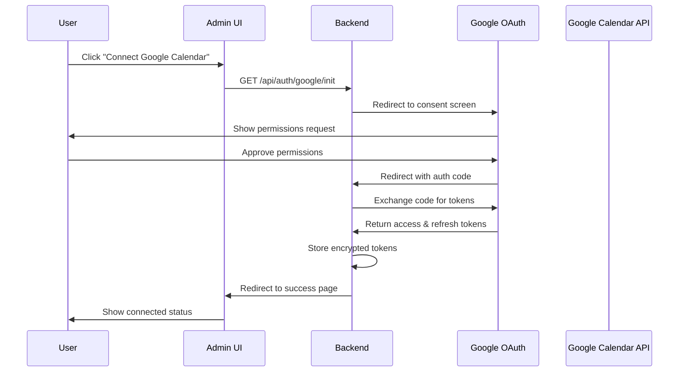

# Google Calendar Admin UI Mockup & Implementation

## UI Mockup

### Visual Design

```
┌─────────────────────────────────────────────────────────────────┐
│  🎯 AlwaysPickup-Lite Admin                                     │
│  Customize your AI voice agent's prompt and voice.             │
├─────────────────────────────────────────────────────────────────┤
│                                                                 │
│  [Voice Agent Settings Tab] [Google Calendar Tab]               │
│                                                                 │
├─────────────────────────────────────────────────────────────────┤
│                                                                 │
│  📅 Google Calendar Integration                                 │
│  ─────────────────────────────────────────────────────────     │
│                                                                 │
│  ┌───────────────────────────────────────────────────────┐     │
│  │  Connection Status: ⚪ Not Connected                   │     │
│  │                                                        │     │
│  │  Connect your Google Calendar to enable voice-        │     │
│  │  controlled event management.                          │     │
│  │                                                        │     │
│  │  ┌─────────────────────────────────┐                  │     │
│  │  │  🔗 Connect Google Calendar      │                  │     │
│  │  └─────────────────────────────────┘                  │     │
│  │                                                        │     │
│  │  📋 Required Permissions:                             │     │
│  │  • Read calendar events                               │     │
│  │  • Create and modify events                           │     │
│  │  • Access event attendees                             │     │
│  └───────────────────────────────────────────────────────┘     │
│                                                                 │
└─────────────────────────────────────────────────────────────────┘
```

### Connected State

```
┌─────────────────────────────────────────────────────────────────┐
│  📅 Google Calendar Integration                                 │
│  ─────────────────────────────────────────────────────────     │
│                                                                 │
│  ┌───────────────────────────────────────────────────────┐     │
│  │  Connection Status: ✅ Connected                       │     │
│  │                                                        │     │
│  │  📧 Connected Account: user@gmail.com                  │     │
│  │  🕐 Last Synced: 2 minutes ago                        │     │
│  │  📊 Calendar: Primary Calendar                         │     │
│  │                                                        │     │
│  │  ┌─────────────────────────┐                          │     │
│  │  │  ❌ Disconnect          │                          │     │
│  │  └─────────────────────────┘                          │     │
│  │                                                        │     │
│  │  ✅ Your voice agent can now:                         │     │
│  │  • Schedule meetings via voice commands               │     │
│  │  • Query upcoming events                              │     │
│  │  • Update or cancel appointments                      │     │
│  │  • Check availability                                 │     │
│  └───────────────────────────────────────────────────────┘     │
│                                                                 │
└─────────────────────────────────────────────────────────────────┘
```

### Error State

```
┌─────────────────────────────────────────────────────────────────┐
│  📅 Google Calendar Integration                                 │
│  ─────────────────────────────────────────────────────────     │
│                                                                 │
│  ┌───────────────────────────────────────────────────────┐     │
│  │  Connection Status: ❌ Error                           │     │
│  │                                                        │     │
│  │  ⚠️  Authentication failed. Please try again.          │     │
│  │                                                        │     │
│  │  Error: Access denied - insufficient permissions       │     │
│  │                                                        │     │
│  │  ┌─────────────────────┐  ┌─────────────────┐        │     │
│  │  │  🔄 Try Again       │  │  📚 Get Help    │        │     │
│  │  └─────────────────────┘  └─────────────────┘        │     │
│  └───────────────────────────────────────────────────────┘     │
│                                                                 │
└─────────────────────────────────────────────────────────────────┘
```

## Code Implementation Structure

### 1. Updated Admin App Component

```typescript
// admin/src/App.tsx
import { useState } from 'react'
import VoiceSettings from './components/VoiceSettings'
import GoogleCalendarAuth from './components/GoogleCalendarAuth'

function App() {
  const [activeTab, setActiveTab] = useState<'voice' | 'calendar'>('voice')

  return (
    <div className="container">
      <header>
        <h1>🎯 AlwaysPickup-Lite Admin</h1>
        <p>Manage your AI voice agent settings and integrations.</p>
      </header>

      <div className="tabs">
        <button 
          className={`tab ${activeTab === 'voice' ? 'active' : ''}`}
          onClick={() => setActiveTab('voice')}
        >
          🎤 Voice Settings
        </button>
        <button 
          className={`tab ${activeTab === 'calendar' ? 'active' : ''}`}
          onClick={() => setActiveTab('calendar')}
        >
          📅 Google Calendar
        </button>
      </div>

      <main>
        {activeTab === 'voice' ? <VoiceSettings /> : <GoogleCalendarAuth />}
      </main>

      <footer>
        {/* Footer content */}
      </footer>
    </div>
  )
}
```

### 2. Google Calendar Auth Component

```typescript
// admin/src/components/GoogleCalendarAuth.tsx
import { useState, useEffect } from 'react'
import { useGoogleAuth } from '../hooks/useGoogleAuth'

export default function GoogleCalendarAuth() {
  const { 
    isConnected, 
    isLoading, 
    error, 
    accountEmail, 
    lastSynced,
    connect,
    disconnect,
    checkStatus 
  } = useGoogleAuth()

  useEffect(() => {
    checkStatus()
  }, [])

  if (isLoading) {
    return (
      <div className="calendar-section">
        <div className="loading">
          <div className="spinner"></div>
          <p>Checking connection status...</p>
        </div>
      </div>
    )
  }

  if (isConnected) {
    return (
      <div className="calendar-section">
        <h2>📅 Google Calendar Integration</h2>
        
        <div className="status-card connected">
          <div className="status-header">
            <span className="status-indicator success">✅</span>
            <h3>Connected</h3>
          </div>
          
          <div className="account-info">
            <p><strong>📧 Account:</strong> {accountEmail}</p>
            <p><strong>🕐 Last Synced:</strong> {lastSynced}</p>
            <p><strong>📊 Calendar:</strong> Primary Calendar</p>
          </div>
          
          <button 
            className="disconnect-btn"
            onClick={disconnect}
          >
            ❌ Disconnect
          </button>
          
          <div className="features-list">
            <h4>✅ Your voice agent can now:</h4>
            <ul>
              <li>Schedule meetings via voice commands</li>
              <li>Query upcoming events</li>
              <li>Update or cancel appointments</li>
              <li>Check availability</li>
            </ul>
          </div>
        </div>
      </div>
    )
  }

  return (
    <div className="calendar-section">
      <h2>📅 Google Calendar Integration</h2>
      
      <div className="status-card">
        <div className="status-header">
          <span className="status-indicator">⚪</span>
          <h3>Not Connected</h3>
        </div>
        
        <p className="description">
          Connect your Google Calendar to enable voice-controlled event management.
        </p>
        
        {error && (
          <div className="error-message">
            <p>⚠️ {error}</p>
          </div>
        )}
        
        <button 
          className="connect-btn"
          onClick={connect}
          disabled={isLoading}
        >
          🔗 Connect Google Calendar
        </button>
        
        <div className="permissions-info">
          <h4>📋 Required Permissions:</h4>
          <ul>
            <li>Read calendar events</li>
            <li>Create and modify events</li>
            <li>Access event attendees</li>
          </ul>
        </div>
      </div>
    </div>
  )
}
```

### 3. Google Auth Hook

```typescript
// admin/src/hooks/useGoogleAuth.ts
import { useState, useCallback } from 'react'

interface GoogleAuthState {
  isConnected: boolean
  isLoading: boolean
  error: string | null
  accountEmail: string | null
  lastSynced: string | null
}

export function useGoogleAuth() {
  const [state, setState] = useState<GoogleAuthState>({
    isConnected: false,
    isLoading: false,
    error: null,
    accountEmail: null,
    lastSynced: null
  })

  const checkStatus = useCallback(async () => {
    setState(prev => ({ ...prev, isLoading: true }))
    try {
      const response = await fetch('/api/auth/google/status')
      const data = await response.json()
      
      setState({
        isConnected: data.isConnected,
        isLoading: false,
        error: null,
        accountEmail: data.email || null,
        lastSynced: data.lastSynced || null
      })
    } catch (error) {
      setState(prev => ({
        ...prev,
        isLoading: false,
        error: 'Failed to check connection status'
      }))
    }
  }, [])

  const connect = useCallback(async () => {
    try {
      // Generate CSRF token
      const csrfToken = generateCSRFToken()
      sessionStorage.setItem('oauth_csrf', csrfToken)
      
      // Redirect to OAuth flow
      window.location.href = `/api/auth/google/init?state=${csrfToken}`
    } catch (error) {
      setState(prev => ({
        ...prev,
        error: 'Failed to initiate connection'
      }))
    }
  }, [])

  const disconnect = useCallback(async () => {
    if (!confirm('Are you sure you want to disconnect your Google Calendar?')) {
      return
    }

    setState(prev => ({ ...prev, isLoading: true }))
    try {
      const response = await fetch('/api/auth/google/disconnect', {
        method: 'POST'
      })
      
      if (response.ok) {
        setState({
          isConnected: false,
          isLoading: false,
          error: null,
          accountEmail: null,
          lastSynced: null
        })
      } else {
        throw new Error('Failed to disconnect')
      }
    } catch (error) {
      setState(prev => ({
        ...prev,
        isLoading: false,
        error: 'Failed to disconnect calendar'
      }))
    }
  }, [])

  return {
    ...state,
    connect,
    disconnect,
    checkStatus
  }
}

function generateCSRFToken(): string {
  return Math.random().toString(36).substring(2, 15) + 
         Math.random().toString(36).substring(2, 15)
}
```

### 4. Backend OAuth Implementation

```typescript
// server.js additions
import { google } from 'googleapis'

// OAuth2 client setup
const oauth2Client = new google.auth.OAuth2(
  process.env.GOOGLE_CLIENT_ID,
  process.env.GOOGLE_CLIENT_SECRET,
  process.env.GOOGLE_REDIRECT_URI
)

// Token storage
const TOKEN_FILE = path.join(__dirname, 'google_tokens.json')

// OAuth endpoints
fastify.get('/api/auth/google/init', async (request, reply) => {
  const { state } = request.query
  
  const authUrl = oauth2Client.generateAuthUrl({
    access_type: 'offline',
    scope: [
      'https://www.googleapis.com/auth/calendar',
      'https://www.googleapis.com/auth/calendar.events'
    ],
    state: state
  })
  
  reply.redirect(authUrl)
})

fastify.get('/api/auth/google/callback', async (request, reply) => {
  const { code, state } = request.query
  
  try {
    // Verify CSRF state
    // Exchange code for tokens
    const { tokens } = await oauth2Client.getToken(code)
    
    // Store tokens securely
    await fs.writeJson(TOKEN_FILE, {
      tokens: encryptTokens(tokens),
      email: await getGoogleEmail(tokens.access_token),
      lastSynced: new Date().toISOString()
    })
    
    reply.redirect('/admin?calendar=connected')
  } catch (error) {
    fastify.log.error('OAuth callback error:', error)
    reply.redirect('/admin?calendar=error')
  }
})

fastify.get('/api/auth/google/status', async (request, reply) => {
  try {
    if (await fs.pathExists(TOKEN_FILE)) {
      const data = await fs.readJson(TOKEN_FILE)
      reply.send({
        isConnected: true,
        email: data.email,
        lastSynced: data.lastSynced
      })
    } else {
      reply.send({ isConnected: false })
    }
  } catch (error) {
    reply.send({ isConnected: false })
  }
})

fastify.post('/api/auth/google/disconnect', async (request, reply) => {
  try {
    await fs.remove(TOKEN_FILE)
    reply.send({ success: true })
  } catch (error) {
    reply.status(500).send({ error: 'Failed to disconnect' })
  }
})
```

### 5. CSS Styles

```css
/* admin/src/App.css additions */

/* Tabs */
.tabs {
  display: flex;
  gap: 1rem;
  margin-bottom: 2rem;
  border-bottom: 2px solid #e0e0e0;
}

.tab {
  padding: 0.75rem 1.5rem;
  background: none;
  border: none;
  cursor: pointer;
  font-size: 1rem;
  color: #666;
  transition: all 0.2s;
  position: relative;
}

.tab:hover {
  color: #333;
}

.tab.active {
  color: #007bff;
  font-weight: 600;
}

.tab.active::after {
  content: '';
  position: absolute;
  bottom: -2px;
  left: 0;
  right: 0;
  height: 2px;
  background: #007bff;
}

/* Calendar Section */
.calendar-section {
  max-width: 600px;
  margin: 0 auto;
}

.calendar-section h2 {
  margin-bottom: 1.5rem;
  color: #333;
}

.status-card {
  background: white;
  border-radius: 12px;
  padding: 2rem;
  box-shadow: 0 2px 8px rgba(0, 0, 0, 0.1);
}

.status-header {
  display: flex;
  align-items: center;
  gap: 1rem;
  margin-bottom: 1.5rem;
}

.status-indicator {
  font-size: 1.5rem;
}

.status-indicator.success {
  color: #28a745;
}

.account-info {
  background: #f8f9fa;
  padding: 1rem;
  border-radius: 8px;
  margin-bottom: 1.5rem;
}

.account-info p {
  margin: 0.5rem 0;
  color: #666;
}

.connect-btn {
  background: #4285f4;
  color: white;
  border: none;
  padding: 0.75rem 2rem;
  font-size: 1rem;
  border-radius: 8px;
  cursor: pointer;
  transition: background 0.2s;
}

.connect-btn:hover {
  background: #357ae8;
}

.disconnect-btn {
  background: #dc3545;
  color: white;
  border: none;
  padding: 0.5rem 1rem;
  font-size: 0.9rem;
  border-radius: 6px;
  cursor: pointer;
  transition: background 0.2s;
}

.disconnect-btn:hover {
  background: #c82333;
}

.permissions-info,
.features-list {
  margin-top: 1.5rem;
  padding-top: 1.5rem;
  border-top: 1px solid #e0e0e0;
}

.permissions-info h4,
.features-list h4 {
  margin-bottom: 0.75rem;
  color: #555;
}

.permissions-info ul,
.features-list ul {
  list-style: none;
  padding: 0;
}

.permissions-info li,
.features-list li {
  padding: 0.5rem 0;
  padding-left: 1.5rem;
  position: relative;
  color: #666;
}

.permissions-info li::before,
.features-list li::before {
  content: '•';
  position: absolute;
  left: 0;
  color: #007bff;
}

.error-message {
  background: #f8d7da;
  color: #721c24;
  padding: 1rem;
  border-radius: 6px;
  margin-bottom: 1rem;
}

.loading {
  text-align: center;
  padding: 3rem;
}

.spinner {
  width: 40px;
  height: 40px;
  border: 4px solid #f3f3f3;
  border-top: 4px solid #007bff;
  border-radius: 50%;
  animation: spin 1s linear infinite;
  margin: 0 auto 1rem;
}

@keyframes spin {
  0% { transform: rotate(0deg); }
  100% { transform: rotate(360deg); }
}
```

## OAuth2 Flow Diagram



## Security Considerations

1. **CSRF Protection**
   - Generate unique state parameter for each OAuth flow
   - Validate state on callback

2. **Token Storage**
   - Encrypt tokens before storage
   - Use environment variables for encryption key
   - Never expose tokens to frontend

3. **Session Management**
   - Validate admin session before OAuth operations
   - Implement proper logout flow

4. **Error Handling**
   - Clear error messages for users
   - Detailed logging for debugging
   - Graceful fallbacks

## Next Steps

1. Implement the OAuth2 backend endpoints
2. Create the React components
3. Set up Google Cloud Project
4. Test the authentication flow
5. Add token refresh logic
6. Implement calendar function tools
